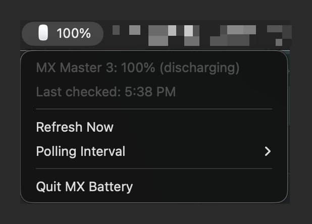

# MX Battery

macOS menu bar app showing the real battery percentage of a Logitech
MX Master 3 / 3S / 4 mouse connected over Bluetooth.

macOS's native Bluetooth battery indicator reads a generic battery
service that these mice do not keep updated, so it shows a static 100%
regardless of actual charge. MX Battery queries the mouse directly
with Logitech's HID++ 2.0 protocol (the same mechanism Logi Options+
uses), with no Logitech software installed.

Not affiliated with or endorsed by Logitech. Logitech, Logi, and
MX Master are trademarks of Logitech.



## What it does

- Polls the mouse over the HID++ vendor channel (default every
  5 minutes; configurable 1/5/15/30 min from the menu).
- Menu bar shows the mouse glyph with the percentage; a lightning bolt
  while charging; an em dash when the mouse is disconnected or asleep.
- Clicking the icon shows device name, percentage, charge state, last
  check time, a Refresh Now action, polling interval settings, and
  Quit.
- Feature discovery is dynamic: it asks the ROOT feature (0x0000) for
  UNIFIED_BATTERY (0x1004, newer devices) and falls back to
  BATTERY_STATUS (0x1000, e.g. MX Master 3). Feature indices are
  looked up per device, never hardcoded.
- Settings persist in `~/Library/Application Support/MX Battery/`.

## Security posture

- **Read-only toward the device.** The only HID reports ever sent are
  two query functions: `ROOT.getFeature` and the battery get-status
  call. No configuration, remapping, macro, or firmware code exists in
  this project.
- **No network access.** Nothing imports a network module; no
  telemetry, no update checks.
- **One permission: Input Monitoring.** macOS gates *all* HID device
  access (even read-only, single-device) behind Input Monitoring
  (`IOHIDDeviceOpen` returns kIOReturnNotPermitted without it). The
  app opens only the Logitech vendor interface of a supported mouse,
  in shared (non-exclusive) mode. No Accessibility, Camera, or other
  permissions.
- **No third-party HID stack.** Device access is this repo's own
  ~180-line `mxbattery/machid.py` (ctypes + IOKit, Python stdlib only),
  so the entire HID code path is auditable in one file. The only
  dependencies are the pinned UI stack (`rumps`/`pyobjc`), which never
  touches the device.
- `audit.sh` runs the maintenance checks (pip-audit CVE scan, embedded
  Python currency, the guarantees above, pin discipline, deploy
  drift). See "Maintenance audit" below.

## Requirements

- macOS on Apple Silicon or Intel (developed on macOS 15+)
- Homebrew Python 3.13 (`brew install python@3.13`)
- A supported mouse paired over Bluetooth (not the Logi Bolt/Unifying
  USB receiver — receiver mode uses a different transport this app
  does not implement)

## Install (prebuilt)

Download `MXBattery-x.y.z.zip` and `checksums.txt` from
[Releases](https://github.com/pcolman/mx-battery/releases), then:

```sh
shasum -a 256 -c checksums.txt   # must print: MXBattery-x.y.z.zip: OK
unzip MXBattery-x.y.z.zip && mv MXBattery.app /Applications/
```

The app is not notarized with Apple, so Gatekeeper warns on first
open: right-click MXBattery.app > Open > Open (one time only). Then
grant Input Monitoring (see "Package as MXBattery.app" below for why
macOS requires it) and relaunch. If you'd rather not trust a prebuilt
binary, building from source takes four commands:

## Install from source

```sh
git clone https://github.com/pcolman/mx-battery.git
cd mx-battery
/opt/homebrew/bin/python3.13 -m venv .venv
.venv/bin/pip install -r requirements.txt
```

## Run (development)

```sh
.venv/bin/python -m mxbattery.app
```

First run prompts for Input Monitoring for the hosting process. For
ad-hoc protocol checks there is also a standalone probe:

```sh
.venv/bin/python hidpp_probe.py
```

## Package as MXBattery.app

```sh
.venv/bin/pip install -r requirements-build.txt
rm -rf build dist
.venv/bin/python setup.py py2app
```

Produces a fully standalone `dist/MXBattery.app` (embedded Python
framework; no venv needed at runtime). Copy it to `/Applications`.
macOS may silently deny HID access on first launch instead of
prompting (common for locally built, ad-hoc-signed apps): add
MXBattery.app manually under System Settings > Privacy & Security >
Input Monitoring (`+`, select the .app, toggle ON), then quit and
relaunch the app.

## Updating the installed app

TCC (Input Monitoring) identifies the app by its main executable's
signature, and the app's Python source is not part of that signature.
So there are two update paths:

- **Python-only changes** (anything in `mxbattery/` or `launcher.py`):
  run `./update_app.sh`. It syncs the source into
  `/Applications/MXBattery.app` in place and relaunches. The
  permission grant survives; no System Settings visit.
- **Everything else** (dependency bumps, Python upgrade, setup.py):
  full `python setup.py py2app` rebuild, replace the app, re-add it in
  Input Monitoring, relaunch.

To make even full rebuilds keep their grant, give the app a stable
signing identity once: in Keychain Access, Certificate Assistant >
Create a Certificate (e.g. "MXBattery Signing", Self-Signed Root,
Code Signing), then after each rebuild:

```sh
codesign --force --deep --sign "MXBattery Signing" dist/MXBattery.app
```

The first signed build needs one last Input Monitoring re-add; after
that, TCC matches on bundle id + certificate instead of the per-build
hash, so subsequent signed rebuilds keep the grant.

## Start at login

System Settings > General > Login Items & Extensions > Open at Login >
`+` > select `MXBattery.app`.

## Maintenance audit

Run `./audit.sh` monthly and after any dependency change. It checks:
known CVEs across the venv (pip-audit), whether the bundle's embedded
Python has fallen behind Homebrew's security releases, the no-network
and read-only-HID guarantees, `==` pinning discipline, and drift
between source and the installed app. pip-audit queries the PyPI
advisory database over the network; that is a dev-machine action only
— the app itself remains network-free.

Known accepted risk: setuptools is pinned to 80.9.0 (PYSEC-2026-3447,
fixed in 83.0.0) because py2app's boot script requires pkg_resources,
which newer setuptools removed. Build-time only, not reachable through
the running app; revisit when py2app drops the pkg_resources
dependency.

## Troubleshooting

- **Menu shows "Mouse not responding (cannot open ...)"** — Input
  Monitoring is missing for the app. Grant it and relaunch.
- **"Mouse not connected"** — the mouse is off, asleep, or paired to
  another host. It recovers automatically on the next poll (or use
  Refresh Now).
- **Charging but no percentage shown** — expected on the MX Master 3:
  its BATTERY_STATUS feature reports the level as invalid while on
  external power. The percentage returns when unplugged.
- **Launch Error dialog from a rebuilt bundle** — run
  `dist/MXBattery.app/Contents/MacOS/MXBattery` in Terminal to see the
  real traceback.
- **A different MX Master model isn't detected** — add its Bluetooth
  product ID to `SUPPORTED_PIDS` in `mxbattery/hidpp.py` (find it in
  System Information > Bluetooth).

## Implementation notes

- HID++ long report: ID `0x11`, 20 bytes, device index `0xFF` for
  direct Bluetooth devices. Responses are matched on device index,
  feature index, and software ID; unsolicited events are ignored.
  HID++ error frames (`0xFF` in the feature slot) are surfaced as
  "not responding".
- HID transport is `mxbattery/machid.py`: IOHIDManager enumeration,
  `IOHIDDeviceOpen` with options 0 (shared — never seizes the system
  pointer), `IOHIDDeviceSetReport` for the query, and an input-report
  callback pumped via `CFRunLoopRunInMode` for responses. One physical
  Bluetooth mouse is one IOHIDDevice on macOS, so no per-collection
  interface selection is needed.
- Protocol reference: the Solaar project's documentation of HID++ 2.0
  (https://github.com/pwr-Solaar/Solaar). Reimplemented from scratch;
  no Solaar code or dependencies are used.

## License

GPL-3.0 — see [LICENSE](LICENSE).
